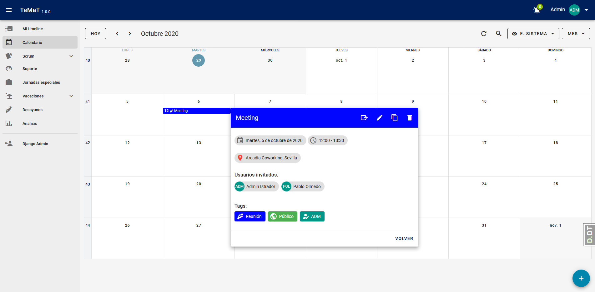

# TeMaT - TEam MAnagement Tool


[](https://open.vscode.dev/pablolmedorado/temat)


## 👀 Overview

Our development team used to manage all the team-related stuff using Excel files in a shared drive. I decided, as a side project, to develop a simple SPA that allowed us to get rid of them.

The app consists of 6 main modules:

- A **calendar** where see relevant common events.
- A **Scrum-based** work manager.
- **Holidays** management.
- "**Support**" management (each day a team member is responsible for the support inbox).
- **Special working days** management (mainly public holidays).
- An "**analytical**" module with multiple charts related to the other 5 modules.

One extra module was added due to popular acclaim: **Breakfasts management**.



Table of Contents:

- [TeMaT - TEam MAnagement Tool](#temat---team-management-tool)
  - [👀 Overview](#-overview)
  - [🧱 Tech stack](#-tech-stack)
    - [🐳 Container](#-container)
    - [🐘 Database](#-database)
    - [🐍 Backend](#-backend)
    - [👁️ Frontend](#️-frontend)
  - [⚙️ Configuring the app](#️-configuring-the-app)
    - [✔️ Configuration parameters](#️-configuration-parameters)
  - [🏃‍♀️ Running the app](#️-running-the-app)
    - [🏠 Locally](#-locally)
    - [🐳 Docker](#-docker)
    - [📦 VS Code Dev Container](#-vs-code-dev-container)
  - [💻 Accessing the app](#-accessing-the-app)
  - [📚 Populating the db](#-populating-the-db)
  - [📝 Disclaimer](#-disclaimer)
  - [📜 Changelog](#-changelog)
  - [🧾 License](#-license)

## 🧱 Tech stack

### 🐳 Container

- [Docker](https://www.docker.com/)

### 🐘 Database

- [PostgreSQL](https://www.postgresql.org/)

### 🐍 Backend

- [Django](https://www.djangoproject.com/)
- [Django Rest Framework](https://www.django-rest-framework.org/)

### 👁️ Frontend

- [Vue.js](https://vuejs.org/)
- [Vuetify](https://vuetifyjs.com/en/)

## ⚙️ Configuring the app

The app needs to be configured before running it and it can be done in 2 ways:

1. Placing a ```.env``` file in ```backend/temat```. Example: [.env.example](backend/temat/.env.example)
2. Declaring environment variables (prefixed with ```TEMAT_```).

### ✔️ Configuration parameters

| Prefix (for env vars) | Param | Description | Default value |
|-|-|-|-|
| TEMAT\_ | **ENV** | Execution environment. Can be: ```development``` or ```production``` | ```production``` |
| TEMAT\_ | **DEBUG** | Django debug. Can be: ```on``` or ```off``` | ```off``` |
| TEMAT\_ | **SECRET\_KEY** | Django secret key. **MANDATORY**. [Need a new one?](https://djecrety.ir/) |  |
| TEMAT\_ | **DATABASE\_URL** | Database connection url. [Django environ](https://django-environ.readthedocs.io/en/latest/) format | ```sqlite:///[PROJECT_DIR]/db.sqlite3``` |

## 🏃‍♀️ Running the app

### 🏠 Locally

1. Prerequisites

   - [PostgreSQL 13 (Optional)](https://www.postgresql.org/download/)
   - [Python 3.7](https://www.python.org/downloads/)
     - [Pipenv](https://pipenv.readthedocs.io/en/latest/)
   - [Node.js](https://nodejs.org/en/download/)

2. Installing dependencies

    ```bash
    cd frontend
    npm ci
    cd ../backend
    pipenv sync --dev
    ```

3. Running migrations

    ```bash
    cd backend
    pipenv run python manage.py migrate
    ```

4. Populating models with initial data

    ```bash
    cd backend
    pipenv run python manage.py loaddata initial_data
    ```

5. Creating an admin user

    ```bash
    cd backend
    pipenv run python manage.py createsuperuser
    ```

6. Serving the app

    - Development mode

      - Python shell

          ```bash
          cd backend
          pipenv run runserver
          ```

      - Node shell

          ```bash
          cd frontend
          npm run serve
          ```

    - Production mode

      1. Build

          ```bash
          cd frontend
          npm run build
          ```

      2. Serve

          ```bash
          cd backend
          pipenv run python manage.py collectstatic --no-input
          pipenv run serve
          ```

### 🐳 Docker

1. Pulling and running the image

    ```bash
    docker run -d --name temat --env-file [PATH_TO_ENV_FILE] -p 8000:8000 pablolmedorado/temat:[VERSION]
    ```

2. Running migrations

    ```bash
    docker exec temat pipenv run python manage.py migrate
    ```

3. Populating models with initial data

    ```bash
    docker exec temat pipenv run python manage.py loaddata initial_data
    ```

4. Creating an admin user

    ```bash
    docker exec -ti temat pipenv run python manage.py createsuperuser
    ```

### 📦 VS Code Dev Container

The app has been developed using [VS Code Dev Containers](https://code.visualstudio.com/docs/remote/containers). You can use them to run the app: just open the project folder in VS Code and click in "Open in remote container" option.

Doing this you'll create 3 containers:

- **PostgreSQL** database
- **Adminer** (database manager)
- **VS Code dev container** with all the dependencies and extensions installed

Once the dev container is ready, you'll only need to run migrations, populate models, create an admin user and serve the app.

## 💻 Accessing the app

Once the app has been served, it is available at [http://localhost:8000/](http://localhost:8000/)

## 📚 Populating the db

**It's mandatory to populate some database tables before using the app the first time**. It can be done by using the ```django admin```, available at [http://localhost:8000/admin](http://localhost:8000/admin).

You'll probably want to add **event types** and **user story types**, as they're required fields. I decided not to create default records so everyone could customize them.

## 📝 Disclaimer

- This application has been developed **with barely Vue.js knowledge**. Learning Vue.js was, in fact, the motivation to start developing it. I tried to do my best, but I'm sure there is a bunch of things to improve. I'd like to update the repo with the new good practices I learn. If you want to collaborate, **feel free to send a pull request**.
- The scope of the application was defined according to **my own team's needs**. Again, **feel free to fork the project and change it if it doesn't fit your team's needs**.
- The application doesn't scale well (as it loads the entire user list in the vuex store) neither allow you to manage more than one team. In case you were planning to use it with a big team (>50 people?), I'd change the behaviour of the users dropdown.
- Although the source code is written in english, the app texts are in spanish. I had no time for translate the entire app.

## 📜 Changelog

See [Changelog](CHANGELOG.md).

## 🧾 License

See [License](LICENSE).
